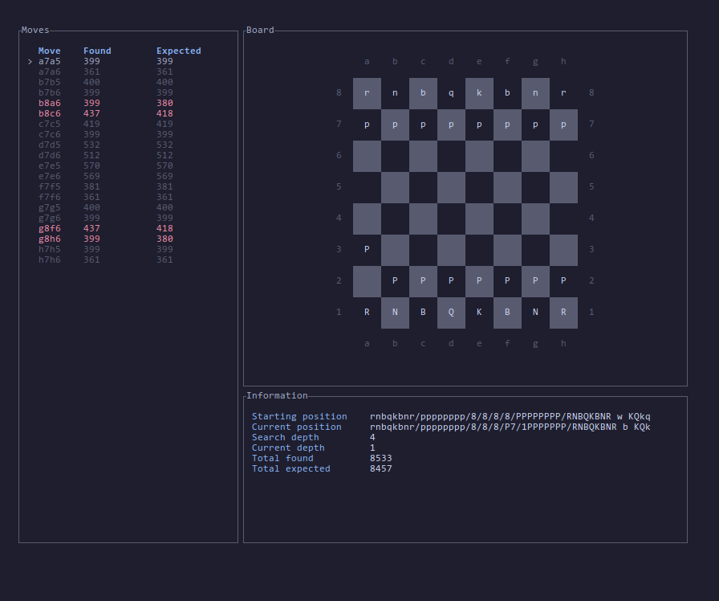

# Perft tool

Mainly used for debugging

### Benchmarking
run `perft bench` to time your perft results

### Debugging
Now comes with a tui tool for debugging perft results.
Run `perft debug` and get dropped into a tui where you can 
walk the search tree, comparing your results at each depth with stockfish.

  

